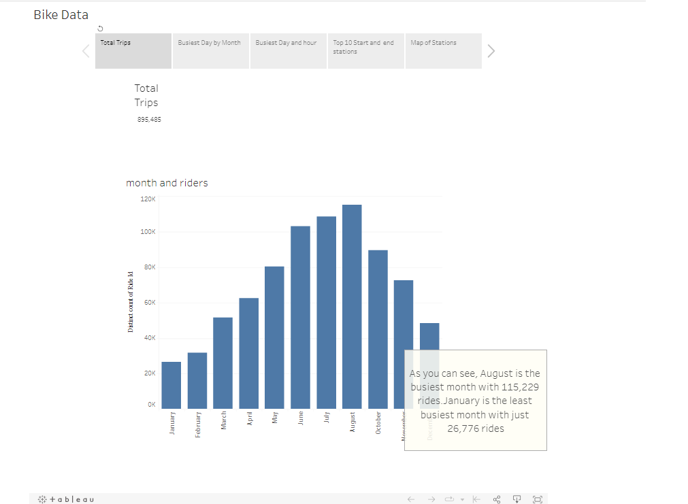
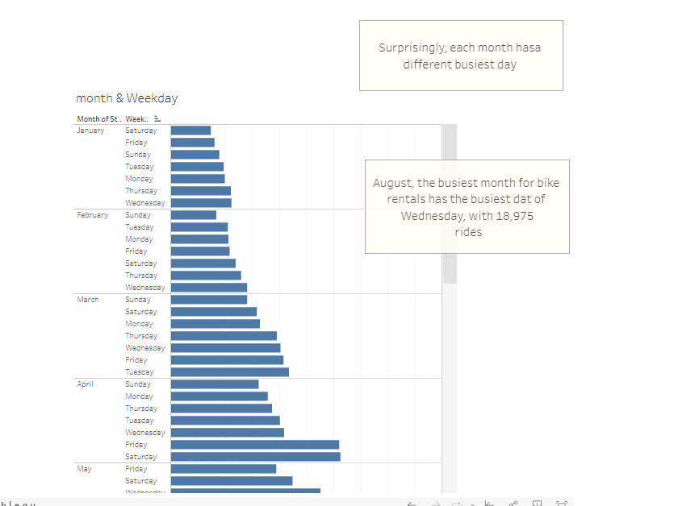
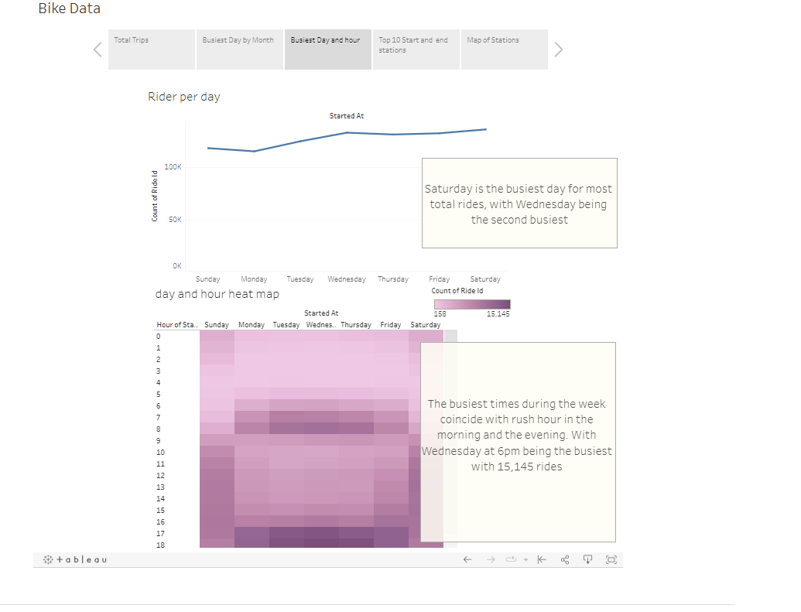
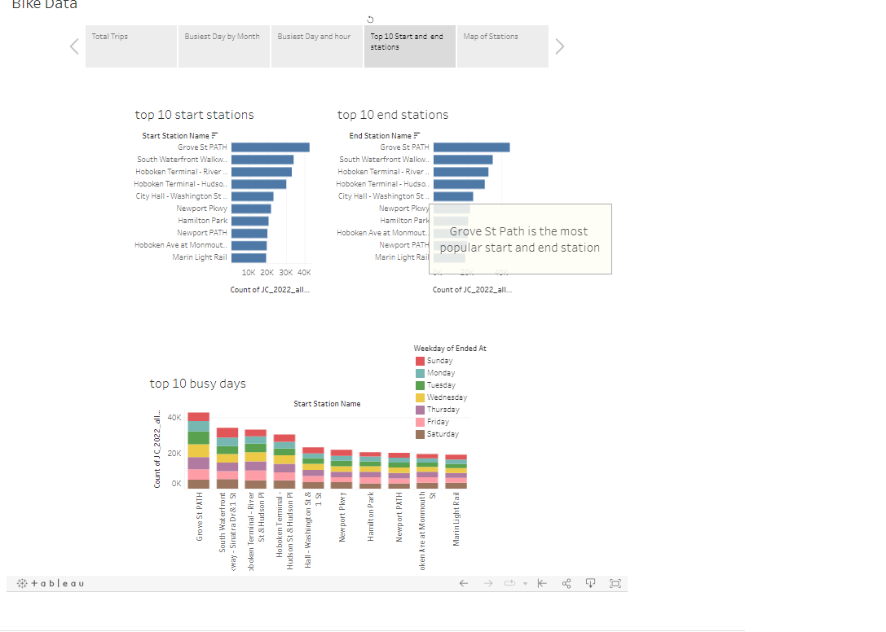
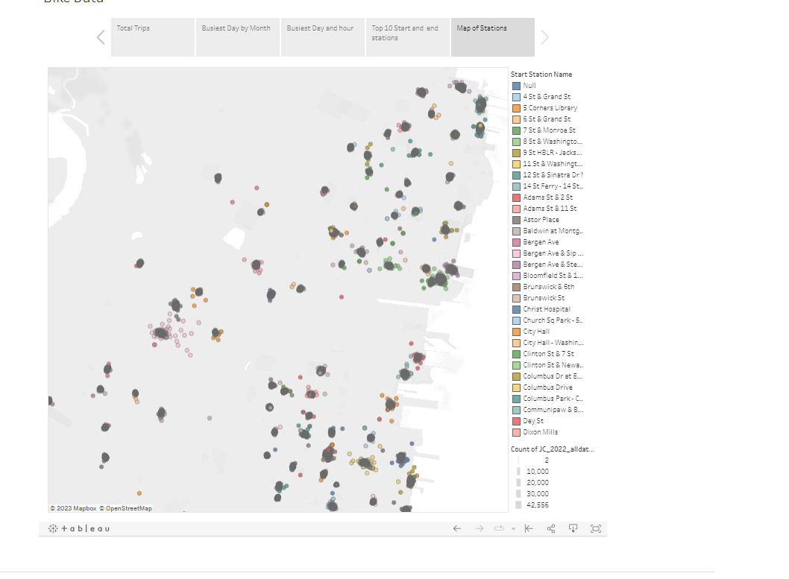

# tableauchallenge
### Data has been colected rom Citi Bike webpage 

##Tableau Public Link
###[CLICK HERE](https://public.tableau.com/app/profile/maura.ellsworth/viz/tableauprojectfinal_16908242813490/BikeData?publish=yes)

### There were 895,485 bike trips taken in Jersey city in 2022. August saw the highest amount of rides with 115,229 ride and January saw the lowest amount with just 26,776. There were more rides taken in the summer months than in the winter mnths. 

### each month has a different busiest day, August, the busiest month had Wednesday as the busiest day.

### Overall, Saturday was the busiest day with 136,828 rides. Wednesday was a close second busiest day with 133,803 rides. We see that Wednesday at 6pm was the busiest day and time of day with 15,145 rides. In general, The morning hours between 7-8 am and thwe evening hours between 5-7 during the week are the busiest times for rentals. This coincides with rush hour. The weekends however, haverelatively the same level of business throughout the day starting at round 9 am. 

### We see that the top 10 start and end bike stations are the exact same. However, Grove St Path is a slightly more popular end station as it is start station as there are 44,730 rides ended there compared to 42,556 rides started there. As we saw with the months, each station has a different busiest day 

